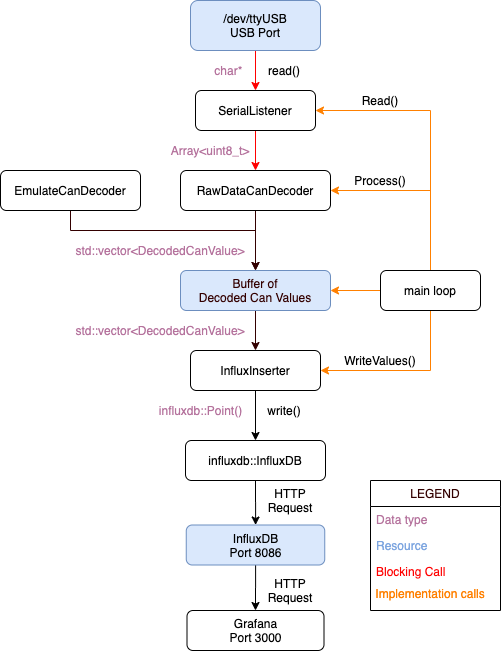

# telemetry-SW

This repository contains an updated version of the [`eclipse-telemetry-SW`](https://github.com/EclipseETS/eclipse-telemetry-SW) software.

The goals of this new version are :
- Make developing telemetry software easier and more accessible
- Better UI and Grafana backend for better visualization
- C++ backend
- Database driven approach for live data and storage

To achieve these, we use the following third-party tools:

- [`Grafana`](https://grafana.com/) for the GUI
- [`InfluxDB`](https://www.influxdata.com/) as a backend for Grafana
- [`InfluxDB-cxx`](https://github.com/awegrzyn/influxdb-cxx) Backend provided by awegrzyn for writing data to the DB
- [`libcurl`](https://curl.haxx.se/libcurl/) as a way to send HTTP commands to InfluxDB

Once the Influx Database is running (either locally or not), writing can be achieved with the influxdb-cxx backend taken from awegrzyn. The backend can create timeseries (aka tables) and entries. However, it cannot create new databases or manage the databases.

To create new databases, or any other InfluxDB command really, `libcurl` is used to send HTTP commands. All the InfluxDB API can be accessed through HTTP posts.


## Illustation of the flow of data at runtime

Here is a high level flow chart of the Telemetry software:




### Reading the serial data

Serial data is provided via USB from a Xbee modem receiving data frames from the vehicle.

Raw data first enters the application through the SerialListener class.
For Unix like machines, this serial flow is accessed as a device living under /dev/ (for instance /dev/ttyUSB0) and initialized using the linux `termios` C library. The current configuration is set to 1 stop bit and 8 bits per word with parity disabled. It is also important to disable canonical reading. Canonical reading would not give correct results for carriage returns, breaks, etc.. which could be valid values in a CAN frame.

The reading is blocking and will halt the application (dataflow loop) until sufficient amount of bytes are received (currently set at 64 bytes)

### Processing and decoding the raw serial data

The RawDataCanDecoder class decodes frame bytes into messages and signals. It is the second step in our flow diagram. Its only interface function is Process() which will call the SerialListener::Read() function. Again, this call is blocking and will halt execution until sufficient packets are received.

Every CAN frame follows a 15 byte format : [header:2] [id:4] [data:8] [crc:1]
The decoder parses this serial information to extract indidividual frames of 15 bytes. The processing into messages and signals is also done by the decoder.

Messages are decoded into a struct format using a map generated at compile-time. Indexing is done with the ID of the message. This message struct contains information about the signals contained. Those signals are then processed individually using the byte offsets provided by the message decode struct.

The signal processing converts raw bytes into the appropriate type of data. Supported data types are :
 - Float
 - Unsigned int (8, 16 or 32 bits)
 - Signed int (8, 16 or 32 bits)

### Writing to the Influx database

The telemetry software uses the third-party influxdb-cxx library. The interface is provided via a unique pointer to the implementation of the library.

The initialization is performed via a URL string to where the influx service is reachable in the following format :
 - "http://localhost:8086?db=db_name"


InfluxDB is a timeseries database. As such, entries are organized by the time of entry. Every timeseries are known as measurements. In our case, every signal is a measurement. Inside a measurement table you will find points (or entries) which are indexed by time of entry. You can find more on the InfluxDB documentation, but in short we write every signal as an individual measurement.

Every measurement (table) can have multiple fields associated (indexed), but we only use the "value" field for consistency. It is also possible to add tags and a custom timestamp to the query, but InfluxDB already uses the current time as default timestammp.

Note that having multiple thousands of measurement writes per second on the database can cause significant slowness. The influxdb-cxx supports batch sizes, for sending batches of entries at a time. The default batch size is currently at 50 points.

### Emulating the serial reading

When the modem or vehicle is not accessible or for testing purposes, it is possible to use a emulated serial decoder for writing random values into the database. Enable with the -emulate command line argument.


## Running the application

To start using the Telemetry software, you will first need to install a few dependencies on your system.

### Install Grafana (OSS release)

**On OSX**

 - Assuming Homebrew is installed, simply run the following line :
```
brew install grafana
```
 
**Other systems**
 - For other systems, follow the instructions on [this page](https://grafana.com/docs/grafana/latest/installation/). Make sure to install the OSS release and not the Enterprise version !
 Note that for Debian or Ubuntu like machines, you may have to add the Grafana repository to the search path of apt-get. The instructions on how to do so are shown in the link above.
 


### Install InfluxDB (OSS release)

**On OSX**
 - Assusimg Homebrew is installed, simply run the following :
```
brew install influxdb
```

**On Linux**
- For any system but Windows, follow the instructions for your system on [this page](https://docs.influxdata.com/influxdb/v1.8/introduction/install/#installing-influxdb-oss).
Similarly, for Ubuntu or Debian machines, you may have to first add the InfluxData repository to the search path of apt-get.

### Starting the services

Once downloaded, you will need to start the Grafana and InfluxDB services.

**On OSX** 
 - Run the lines (if Homebrew is installed) :
```
brew services start grafana
brew services start influxdb
```

To stop the services, run :
```
brew services stop grafana
brew services stop influxdb
```

**On Ubuntu / Debian**
 - Starting depends on whether or not your system uses systemd. 

**If your OS uses systemd**
```
sudo systemctl unmask influxdb.service
sudo systemctl start influxdb
sudo systemctl start grafana-server
```

 - To check that the services are started, you can verify with the `systemctl status` command :
```
sudo systemctl status influxdb
sudo systemctl status grafana-server
```

**If your system is NOT using systemd**
 - Then starting with init.d will probably work. Run the following lines :
```
sudo service grafana-server start
sudo service influxdb start
```

 - Again, make sure the services are started with the `status` option :
```
sudo service grafana-server status
sudo service indluxdb status
```

### Run locally using Docker

 Jasmin, j'ai besoin de ton cours ;(
 
### Run natively (without Docker)

 To do so, you will first need to build the application. The steps are presented in the next section.
 

## Building the application

The build uses CMake to package the dependencies and the commands.
First, install the dev dependencies listed below:

### Install `CMake`

**On Linux**
```
$ sudo apt-get install cmake
```

**On OSX**
 - Using Homebrew:
```
$ brew install cmake
```

**On Windows**
 - Go to [install CMake](https://cmake.org/download/) and follow the instructions


### Install `libcurl` development files

**On Linux (Ubuntu)**

```
$ sudo apt-get update
$ sudo apt-get install -y libcurl4-openssl-dev
```

**On OSX**

Assuming homebrew is installed, simply run the following line:
```
brew install curl
```

**On Windows**

*TODO: Windows needs to be done / tested*

### Install `InfluxDB-cxx`

The library must be built from source in all cases.

**On Unix and OSX**

 - Follow the instructions listed in [InfluxDB-cxx repository](https://github.com/awegrzyn/influxdb-cxx#generic).

**On Windows**

*TODO : Give installation instructions for Windows*

### Building the application

**For Unix systems**
Navigate to the root folder of the project and run the following lines:
```
cmake .
make
```
That's it ! An executable `eclipse_telemetry` will have been built. To run it natively, follow the steps in the next section.

**For Windows**
 - The application can be built but cannot run on Windows at the moment

## Running natively on OSX or Linux

Once the application has been built using Cmake, you can start the application with the following command. Make sure that you pass command line arguments to the executable. At the moment, default execution assumes a Docker container. You will need to change the hostname to `localhost` and the TTY serial device to the one listed in `/dev/`. For testing purposes, you can also use the flag `-emulate` if no serial is present.

Do not add /dev/ in front of your TTY. The application already looks inside the /dev/ folder.

```
./eclipse_telemetry -hostname localhost -tty <your_tty_device>
```

### Command line arguments for native build

The telemetry software reads a serial data stream from a Xbee modem and decodes the raw bytes into usable information then pushed into an InfluxDB database. This live database can then be read by Grafana. 

The application and InfluxDB parameters can be passed in via command line arguments :
 - [-emulate <None>] Sets the application to not use serial and emulate CAN data (random values)
 - [-tty <tty_name>] Sets the name of the TTY device to use, eg. 'ttyUSB0'. '/dev/' prefix is included by default
 - [-dbname <db_name>] Sets the name of the InfluxDB to use. Used in the init query of InfluxDB. Will create a new database with the provided name if not already existing
 - [-hostname] Sets the hostname where the InfluxDB service is located
 
By default, 'ttyS0' is used as serial device input. Default hostname is 'influxdb' and default database name is 'eclipse_db1'


## Contributing

For contributing, simply clone this repo and submit pull requests whenever you feel you added something to the software ! Have fun :)

### Directory hierarchy (summary)

```
TODO
```

### Running tests and test coverage
*TODO*
